# Miért jók a gráfok?

Az adatelemzés "hagyományos" eszközei könnyen feldolgozza az egyes
megfigyelések közti hasonlóságokat, ezért jól lehet őket általános, minden
megfigyelésre érvényes szabályok keresésére használni (pl. nagyobb
eséllyel vásárol-e, aki autóval érkezik, vagy jobban hat-e az új
gyógyszer, mint a régi). Sok jelenség azonban nem az egyes _megfigyelési
egységek_ jellemzőitől függenek, hanem a környzetüktől. Ha valakinek sok
ismerőse beteg, nagyobb eséllyel lesz fertőzött, mint aki nem találkozik beteg emberekkel - hiába gyengébb utóbbinak az immunrendszere.

Az egyes emberek közti ismerettségi kapcsolatok, találkozások, a cégek
közti utalások, gyakori kifejezések nehezen foghatóak meg újabb és újabb
változók felvételével, hiszen - mint azt látni fogjuk - nem csak az
számít, hogy valaki hány emberrel találkozik, hanem hogy azik kik; nem
mindegy, hogy egy cég kis cégekkel dolgoztat vagy nagyokkal, nem mindegy
hogy a szolgáltatásról a vélemény az hogy `jó`, vagy hogy `jó rossz`.

A kapcsolatok (legyen az Facebook-ismeretség, közös iroda, utalás vagy
együtt szereplés egy szövegben) olyan plusz információt hordoznak, ami 
miatt bővíteni kell a táblázatainkat egy másikkal, ami ezeket a 
kapcsolatokat tartalmazza.

# Eszközök

Mivel az eddig megismert eszközökkel nem, vagy csak nagyon körülményesen
tudnánk elemezni a kapcsoaltokat, felmerül a kérdés, milyen szoftverek
vannak felkészítve ilyen problémákra?

## Általánosabb célú eszközök

Az `R` és a `python` irendelkezik hálózatelemző csomagokkal (`igraph`,
`networkX` csak egy-egy példa), ezek többnyire a gép memóriájában tárolják
az összes releváns információt. Ma az `R` `igraph` csomagjával ismerkedhet meg, aki megnézi a kódokat.

## Gráfelemző szoftverek

Hálózatelemzésre specializálódott grafikus programok is léteznek és 
népszerűek. A `Cytoscape` inkább algoritmusokban gazdag, míg a `Gephy`
a gáfok ábrázolását emelte új szintre. Ezek ingyenesen használható
eszközök, ezért több más termék is épít rájuk.

## Gráfalapú adatbázisok

A gráfokat érdemes úgy tárolni, hogy azok könny és gyorsan lekérdezhetőek
legyenek akár egy SQL(-szerű) utasítással. A legszélesebb körben ismert
ilyen eszköz a Neo4j, de nagyvállalatok számára haz SAP és az Oracle is
kínál megoldásokat, míg a Microsoft az SQL Serverbe rakta bele ezt a 
megoldását.

# Hogy működnek a gráfok?

Ez a módszertan nem új találmány: Euler 1736-ban a Königsbergi hidak
problémáját elemezte így; arra a kérdésre kereste a választ, hogy be 
lehet-e járni a várost úgy, hogy minden hídján egyszer megyünk át?


Euler gráfként ábrázolta a várost: a szigeteket illetve a folyó két
partját egy-egy _csúcs_, a hidakat pedig _élek_ jelölték:


```r
data(Koenigsberg)
plot(Koenigsberg,
     main="Königsbergi hidak",
     # vertex.label.cex=2,
     vertex.label=names(V(Koenigsberg)))
```

<div class="figure">
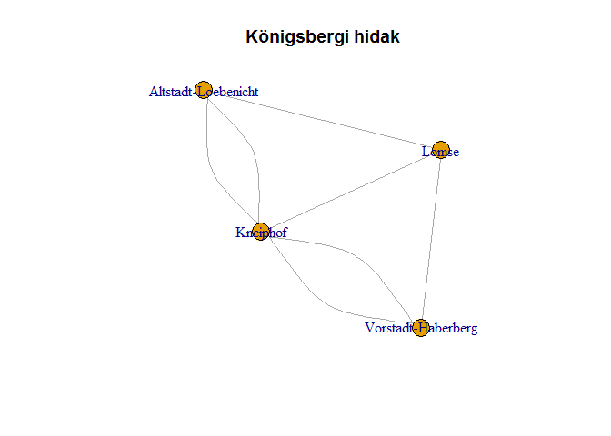
<p class="caption">(\#fig:koenigsberg-bridges)Königsberg látképe az 1700-as években, a hidak zölddel kiemelve.</p>
</div>


A gráfokat nem csak ábrázolva tudjuk vizsgálni: az élek száma, csúcsok 
száma, illetve adott jellemzők (vannak-e nevei a csúcsoknak, van-e 
súlyozás az éleken, stb.) sok információt árulnak el, amikor először 
látunk egy gráfot.


```r
summary(Koenigsberg)
```

```
## IGRAPH 227bd5e UN-- 4 7 -- The seven bidges of Koenigsberg
## + attr: name (g/c), name (v/c), Euler_letter (v/c), Euler_letter
## | (e/c), name (e/c)
```


# Gráftípusok

Az egyszerűbb jellemzés érdekében a gyakori formák és tulajdonságok mind
külön nevet kaptak az évek során.

## Formák

Természetesen külön neve van az olyan gráfoknak, amiknek se csúcsa,
se éle nincs - ezek az üres gráfok:


```r
graf_darabonkent <- graph_from_literal()
summary(graf_darabonkent)
```

```
## IGRAPH f542af5 U--- 0 0 --
```

```r
# graf_darabonkent <- graf_darabonkent + vertex("Első csúcs")
# cat("Egy csúcsú gráf összefoglaló adatai")
# summary(graf_darabonkent)
# 
# graf_darabonkent <- graf_darabonkent + vertex("Második csúcs") + edge(1, 2)
# cat("Több csúcsú gráf összefoglaló adatai")
# summary(graf_darabonkent)
```

Ha egy gráfban minden lehetséges él létezik a csúcsok közt,
azt _teljes gráfnak_ hívjuk.


```r
teljes_halozat <- graph_from_literal(A:B:C:D - A:B:C:D)
plot(teljes_halozat, main="Teljes gráf")
```

<div class="figure">

<p class="caption">(\#fig:teljes-graf)teljes gráf</p>
</div>

```r
summary(teljes_halozat)
```

```
## IGRAPH f54fbdb UN-- 4 6 -- 
## + attr: name (v/c)
```

Amikor sok ember először találkozik és mindenki mindenkinek bemutatkozik, az egy teljes gráf: minden csúcstól minden csúcshoz megy él, összesen
$n*(n-1)/2$ kapcsolat alakul ki. A fenti 4 csúcs esetén ez 6 él,ahogy az összefoglalóban is látjuk.


```r
fa <- make_tree(5)
plot(fa, main="Fa")
```

<div class="figure">
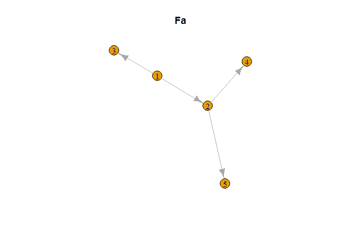
<p class="caption">(\#fig:fa-graf)Egyszerű fa gráf</p>
</div>

```r
summary(fa)
```

```
## IGRAPH f56e01b D--- 5 4 -- Tree
## + attr: name (g/c), children (g/n), mode (g/c)
```

A családfa egy tökéletes példája a _fa_ gráfoknak: van egy kiinduló pont
(kettő), ahonnan van pár _gyerek_, akik _szülei_ a tőlük leágazó gyereknek. Egy gyerek nem kapcsolódhat egyik szülőhöz sem, így nem alakulhat ki _kör_ sem a hálózatban:


```r
kor <- make_ring(5)
plot(kor, main="Körgráf")
```

<div class="figure">
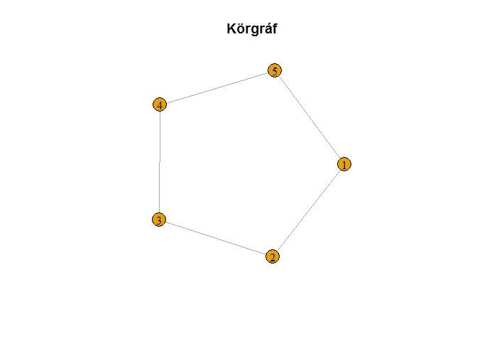
<p class="caption">(\#fig:kor-graf)Körgráf</p>
</div>

```r
summary(kor)
```

```
## IGRAPH f5895e1 U--- 5 5 -- Ring graph
## + attr: name (g/c), mutual (g/l), circular (g/l)
```

Amikor nem mindenki ismer mindenkit, hanem csak egyvalaki, akkor egy 
_csillag_ alakzatot kapunk:


```r
kicsillag <- make_star(5, mode="out")
plot(kicsillag, main="Csillag gráf kifelé irányított élekkel")
```

<div class="figure">
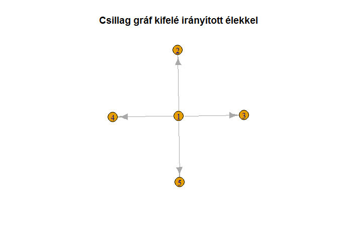
<p class="caption">(\#fig:csillag-graf)Csillag, kifelé mutató élekkel</p>
</div>

```r
summary(kicsillag)
```

```
## IGRAPH f5a284e D--- 5 4 -- Out-star
## + attr: name (g/c), mode (g/c), center (g/n)
```

Azonban vannak embereket, akiket sokan ismernek olyanok, akiet ő nem,
az ő ismerettségi hálója befelé mutató élekkel rendelkező csillag lehet:


```r
becsillag <- make_star(5, mode="in")
plot(becsillag, main="Csillag gráf befelé irányított élekkel")
```

<div class="figure">
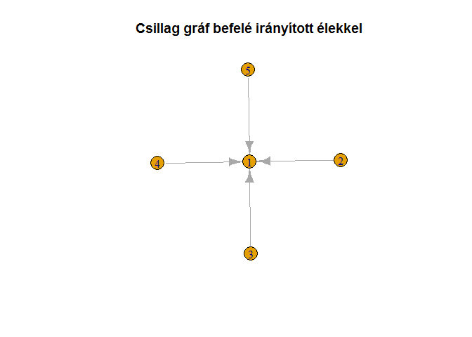
<p class="caption">(\#fig:becsillag)Csillag, befelé mutató élekkel</p>
</div>

## Irányítottság

Az élek irányítottsága kulcsfontosságú. Amennyiben egy gráfnak vannak 
_irányított_ élei, irányítottnak nevezzük az egész gráfot, aminek pedig
nincs, az _irányítatlan_. Ha csúcstól csúcsig szeretnénk sétálni egy
irányított gráfon, akkor csak az élek iránynak megfelelően haladhatnánk.

## Összefüggőség

Az eddig látott gráfok mind _összefüggőek_ voltak, nem volt olyan csúcs,
ami nem csatlakozott volna a többihez. Azonban előfordul, hogy egyes
csúcsok nem kapcsolódnak a többihez - ilyenkor a gráf nem összefüggő,
több _komponensből_ áll.Irányított gráfon előfordulhat, hogy habár
összefüggőnek tűnik a gráf, mégis léteznek egymással kapcsolatban
nem lévő _erősen összefüggő komponensek_: ha egy ilyen komponensen beől kezdünk el sétálni az élek mentén, nem juthatunk el az ebbe a komponensbe nem tartozó csúcsokhoz.


# Gráfok tárolása

A gráfokat tárolni azért nehézkes, mert minden csúcstól mehet él minden 
csúcshoz, így nagyon nagy táblázatokat kellene böngészni hogy mindenről
információt kaphassunk. A leggyakoribb megoldás, hogy táblázatban 
tároljuk _éllistákban_ tároljuk azokat az éleket, amik léteznek a gráfban.
Ez egy táblázat, ahol egy sor egy él - általában az első oszlop az él
kiintulópontja, a másik pedig az érkezési pont, míg további oszlopokban
egyéb tulajdonságokat is fel ehet sorakoztatni.


```r
BP_metro <- data.frame(forras = c("Vörösmarty tér", "Deák Ferenc tér", "Bajcsy-Zsilinszky út", "Opera", "Oktogon", "Vörösmarty utca", "Kodály körönd", "Bajza utca", "Hősök tere", "Széchenyi fürdő",
                                  "Déli pályaudvar", "Széll Kálmán tér", "Batthyány tér", "Kossuth Lajos tér", "Deák Ferenc tér", "Astoria", "Blaha Lujza tér", "Keleti pályaudvar", "Puskás Ferenc Stadion", "Pillangó utca",
                                  "Újpest-Központ", "Újpest-Városkapu", "Gyöngyösi utca", "Forgách utca", "Árpád híd", "Dózsa György út", "Lehet tér", "Nyugati pályaudvar", "Arany János utca", "Deák Ferenc tér", "Ferenciek tere", "Kálvin tér", "Corvin negyed", "Klinikák", "Nagyvárad tér", "Népliget", "Ecseri út", "Pöttyös utca", "Határ út",
                                  "Kelenföld vasútállomás", "Bikás park", "Újbuda-központ", "Móricz Zsigmond körtér", "Szent Gellért tér", "Fővám tér", "Kálvin tér", "Rákóczi tér", "II. János Pál pápa tér"),
                       cel = c("Deák Ferenc tér", "Bajcsy-Zsilinszky út", "Opera", "Oktogon", "Vörösmarty utca", "Kodály körönd", "Bajza utca", "Hősök tere", "Széchenyi fürdő", "Mexikói út vá.", 
                               "Széll Kálmán tér", "Batthyány tér", "Kossuth Lajos tér", "Deák Ferenc tér", "Astoria", "Blaha Lujza tér", "Keleti pályaudvar", "Puskás Ferenc Stadion", "Pillangó utca", "Örs vezér tere",
                                 "Újpest-Városkapu", "Gyöngyösi utca", "Forgách utca", "Árpád híd", "Dózsa György út", "Lehet tér", "Nyugati pályaudvar", "Arany János utca", "Deák Ferenc tér", "Ferenciek tere", "Kálvin tér", "Corvin negyed", "Klinikák", "Nagyvárad tér", "Népliget", "Ecseri út", "Pöttyös utca", "Határ út", "Kőbánya-Kispest",
                               "Bikás park", "Újbuda-központ", "Móricz Zsigmond körtér", "Szent Gellért tér", "Fővám tér", "Kálvin tér", "Rákóczi tér", "II. János Pál pápa tér", "Keleti pályaudvar"),
                       vonal = c(rep("M1", 10),
                                 rep("M2", 10),
                                 rep("M3", 19),
                                 rep("M4", 9)))
BP_metro_graf <- graph_from_data_frame(BP_metro, directed=FALSE)
plot(BP_metro_graf,
     main="Budapest metróhálózata gráfként",
     vertex.size=.2,
     vertex.label.cex=.7,
     edge.color=c("yellow", "red", "blue", "green")[as.factor(E(BP_metro_graf)$vonal)])
```

<div class="figure">
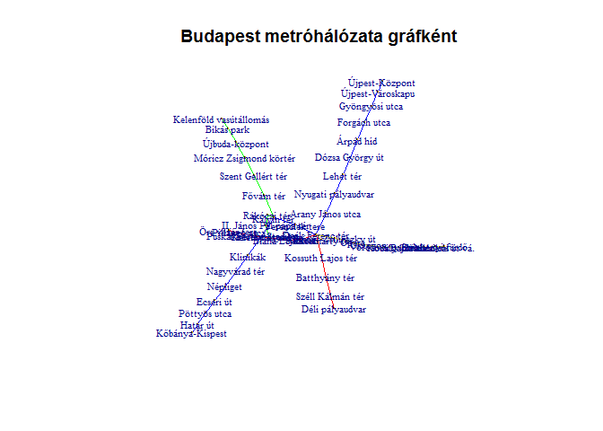
<p class="caption">(\#fig:éllisták)Budapest metróhálózata</p>
</div>

A metróhálózat éllistája így néz ki:


```r
datatable(BP_metro, rownames = FALSE)
```

<!--html_preserve--><div id="htmlwidget-44fd7a9fd40a5ed46b56" style="width:100%;height:auto;" class="datatables html-widget"></div>
<script type="application/json" data-for="htmlwidget-44fd7a9fd40a5ed46b56">{"x":{"filter":"none","data":[["Vörösmarty tér","Deák Ferenc tér","Bajcsy-Zsilinszky út","Opera","Oktogon","Vörösmarty utca","Kodály körönd","Bajza utca","Hősök tere","Széchenyi fürdő","Déli pályaudvar","Széll Kálmán tér","Batthyány tér","Kossuth Lajos tér","Deák Ferenc tér","Astoria","Blaha Lujza tér","Keleti pályaudvar","Puskás Ferenc Stadion","Pillangó utca","Újpest-Központ","Újpest-Városkapu","Gyöngyösi utca","Forgách utca","Árpád híd","Dózsa György út","Lehet tér","Nyugati pályaudvar","Arany János utca","Deák Ferenc tér","Ferenciek tere","Kálvin tér","Corvin negyed","Klinikák","Nagyvárad tér","Népliget","Ecseri út","Pöttyös utca","Határ út","Kelenföld vasútállomás","Bikás park","Újbuda-központ","Móricz Zsigmond körtér","Szent Gellért tér","Fővám tér","Kálvin tér","Rákóczi tér","II. János Pál pápa tér"],["Deák Ferenc tér","Bajcsy-Zsilinszky út","Opera","Oktogon","Vörösmarty utca","Kodály körönd","Bajza utca","Hősök tere","Széchenyi fürdő","Mexikói út vá.","Széll Kálmán tér","Batthyány tér","Kossuth Lajos tér","Deák Ferenc tér","Astoria","Blaha Lujza tér","Keleti pályaudvar","Puskás Ferenc Stadion","Pillangó utca","Örs vezér tere","Újpest-Városkapu","Gyöngyösi utca","Forgách utca","Árpád híd","Dózsa György út","Lehet tér","Nyugati pályaudvar","Arany János utca","Deák Ferenc tér","Ferenciek tere","Kálvin tér","Corvin negyed","Klinikák","Nagyvárad tér","Népliget","Ecseri út","Pöttyös utca","Határ út","Kőbánya-Kispest","Bikás park","Újbuda-központ","Móricz Zsigmond körtér","Szent Gellért tér","Fővám tér","Kálvin tér","Rákóczi tér","II. János Pál pápa tér","Keleti pályaudvar"],["M1","M1","M1","M1","M1","M1","M1","M1","M1","M1","M2","M2","M2","M2","M2","M2","M2","M2","M2","M2","M3","M3","M3","M3","M3","M3","M3","M3","M3","M3","M3","M3","M3","M3","M3","M3","M3","M3","M3","M4","M4","M4","M4","M4","M4","M4","M4","M4"]],"container":"<table class=\"display\">\n  <thead>\n    <tr>\n      <th>forras<\/th>\n      <th>cel<\/th>\n      <th>vonal<\/th>\n    <\/tr>\n  <\/thead>\n<\/table>","options":{"order":[],"autoWidth":false,"orderClasses":false}},"evals":[],"jsHooks":[]}</script><!--/html_preserve-->

# A hálózatok struktúrája

A csúcsok és élek száma, de még az irányítottságuk sem árul el sokat a gráf struktúrájáról.

## Fokszám-eloszlás

Egy csúcs éleinek számát _fokszámnaak_ hívják. Irányított élek esetén
ráadásul van _kifok_ és _befok_, előbbi a csúcstól elfelé, míg utóbbi
a csúcs felé mutat.

Az, hogy a csúcsok hányszázaléka rendelkezik adott mennyiségű éllel,
már jó kapaszkodót ad ahhoz, hogy el tudjuk képzelni a hálózatot.


```r
ggplot(data.frame(arany=degree.distribution(teljes_halozat)[-1],
                  fokszam=1:max(degree(teljes_halozat))),
       aes(x=fokszam, y=arany)) +
  geom_bar(stat="identity") +
  ggtitle("Teljes gráf fokszám-eloszlása") +
     ylab("Adott fokszám előfordulási aránya") +
     xlab("Fokszám")
```

<div class="figure">
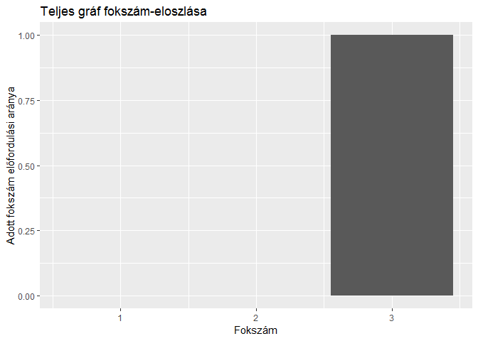
<p class="caption">(\#fig:teljes-fokszámeloszlás)Teljes gráf fokszám-eloszlása</p>
</div>

```r
ggplot(data.frame(arany=degree.distribution(fa)[-1],
                  fokszam=1:max(degree(fa))),
       aes(x=fokszam, y=arany)) +
  geom_bar(stat="identity") +
  ggtitle("Fa gráf fokszám-eloszlása") +
     ylab("Adott fokszám előfordulási aránya") +
     xlab("Fokszám")
```

<div class="figure">

<p class="caption">(\#fig:fa-fokszam)Fa gráf fokszámeloszlása</p>
</div>


```r
ggplot(data.frame(arany=degree.distribution(kor)[-1],
                  fokszam=1:max(degree(kor))),
       aes(x=fokszam, y=arany)) +
  geom_bar(stat="identity") +
  ggtitle("Körgráf fokszám-eloszlása") +
     ylab("Adott fokszám előfordulási aránya") +
     xlab("Fokszám")
```

<div class="figure">

<p class="caption">(\#fig:kor-fokszameloszlas)Körgráf fokszámeloszlása</p>
</div>


```r
csillag <- make_star(5)
ggplot(data.frame(arany=degree.distribution(csillag)[-1],
                  fokszam=1:max(degree(csillag))),
       aes(x=fokszam, y=arany)) +
  geom_bar(stat="identity") +
  ggtitle("Csillag gráf fokszám-eloszlása") +
     ylab("Adott fokszám előfordulási aránya") +
     xlab("Fokszám")
```

<div class="figure">

<p class="caption">(\#fig:csillag-fokszameloszlas)Csillag gráf fokszámeloszlása</p>
</div>


```r
ggplot(data.frame(arany=degree.distribution(BP_metro_graf)[-1],
                  fokszam=1:max(degree(BP_metro_graf))),
       aes(x=fokszam, y=arany)) +
  geom_bar(stat="identity") +
  ggtitle("Budapest metróhálózatának fokszám-eloszlása") +
     ylab("Adott fokszám előfordulási aránya") +
     xlab("Fokszám")
```

<div class="figure">
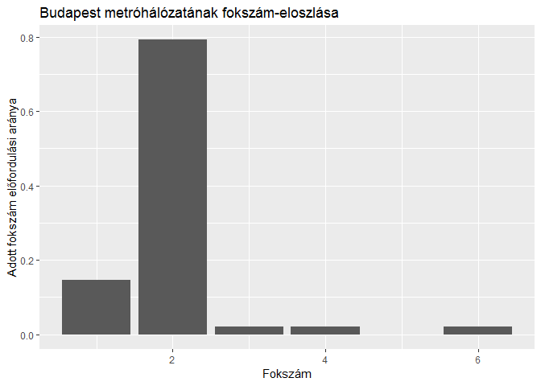
<p class="caption">(\#fig:bp-metro-fokszameloszlas)Budapest metróhálózatának fokszámeloszlása</p>
</div>

## Átmérő

Az átmérő a gráfon megtalálható leghosszabb legrövidebb út. Mivel az út függ attól, hogy a hálózat irányított vagy irányítatlan, az átmérő hossza is függ ettől:

* A létrehozott fa gráf átmérője 2,
* az irányítatlan körgráfé pedig 2.
* Az irányítatlan csillag gráfnak 1,
* míg az irányítottnak csak 1.


## Centralitás

Érdemes megvizsgálni, melyek a fontos csúcsok egy hálózatban, erre sok lehetőség van:

1.  Annál fontosabbnak tekintünk egy csúcsot, minél több kapcsolattal rendelkezik,

2.  minél több csúcsot köt össze,

3.  minél fontosabb csúcsokhoz csatlakozik,

4.  minél nagyobb eséllyel kerül elő véletlenszerűen.


```r
fokszam_centralitas <- centr_degree(BP_metro_graf)
plot(BP_metro_graf,
     main="Budapest metróhálózata fokszám szerinti fontosság alapján",
     vertex.size=fokszam_centralitas$res,
     vertex.label=NA)
```

<!-- -->

```r
tolmacs_problema <- make_star(5, mode="undirected") + make_star(5, mode="undirected") + edge(2, 10)
plot(tolmacs_problema,
     main="Tolmács probléma fokszám szerinti fontosság alapján",
     vertex.size=centr_degree(tolmacs_problema)$res,
     vertex.label=NA)
```

<!-- -->

A tolmács-probléma azt a helyzetet írja le, mikor az információ egy adott emberen keresztül áramlik két csoport közt, így ő tudja szűrni, alakítani annak tartalmát. Erre a köztesség, vagy betweenness-centralitás a megfelelő mérőszám:


```r
koztesseg <- centr_betw(tolmacs_problema)
plot(tolmacs_problema,
     main="Tolmács probléma köztesség szerinti fontosság alapján",
     vertex.size=koztesseg$res,
     vertex.label=NA)
```

<!-- -->

Azonban ez sem mindn esetben ideális, erre az Elnök feleségének példája hozható: az ő esetében sem a kapcsolatok száma, sem a csak rajta átáramló információ mennyisége nem kiugró a környezetéhez képest, azonban az egyik legfontosabb döntéshozóra van jelentős hatása. Tehát minden egyes személy fontossága a hálózatban függ attól, milyen fontos személyekhez kapcsolódik - ezt a sajátérték-centralitás mutatja meg:


```r
elnok_felesege <- make_star(4, mode="undirected") +
                  vertex(5:10) + path(3,5,6) + path(4,7,8,9,10)
                        
sajatertek_centralitas <- centr_eigen(elnok_felesege)
koztesseg_centralitas <- centr_betw(elnok_felesege)
plot(elnok_felesege,
     main="Elnök felesége probléma - köztesség-centralitás",
     vertex.size=koztesseg_centralitas$res/5,
     vertex.label=NA)
```

<!-- -->

```r
plot(elnok_felesege,
     main="Elnök felesége probléma - sajátérték-centralitás",
     vertex.size=sajatertek_centralitas$vector*10,
     vertex.label=NA)
```

<!-- -->

Döntési folyamatokat ezzel a módszerrel jól lehet elemezni, azonban ha azt szeretnénk tudni, hogy egy kérdésre a hálózatban ki tudja a legnagyobb eséllyel a választ, a PageRank algoritmus ad választ:


```r
elnok_felesege_pg <- page_rank(elnok_felesege)
plot(elnok_felesege,
     main="Elnök felesége probléma - PageRank score",
     vertex.size=elnok_felesege_pg$vector*100,
     vertex.label=NA)
```

<!-- -->

## Közösségek

A cél olyan csoportokat keresni egy összefüggő hálózaton, amely csoportokon belül sűrűbbek a kapcsolatok, mint azok között.


```r
data(karate)
summary(karate)
```

```
## IGRAPH 4b458a1 UNW- 34 78 -- Zachary's karate club network
## + attr: name (g/c), Citation (g/c), Author (g/c), Faction (v/n),
## | name (v/c), label (v/c), color (v/n), weight (e/n)
```

```r
plot(karate,
     main="Karate klub hálózat")
```

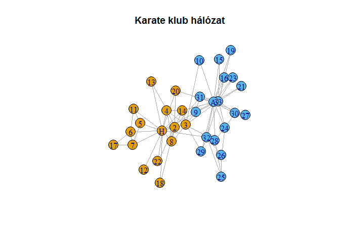<!-- -->

```r
random_walk_community <- cluster_walktrap(karate, weights=NULL)
plot(random_walk_community,
     karate,
     main="Véletlen séta alapú közösségek a karate klubban")
```

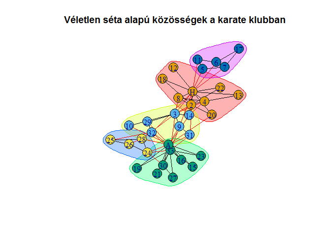<!-- -->

```r
edge_betw_community <- cluster_edge_betweenness(karate, weights=NULL)
plot(edge_betw_community,
     karate,
     main="Élköztesség alapú közösségek a karate klubban")
```

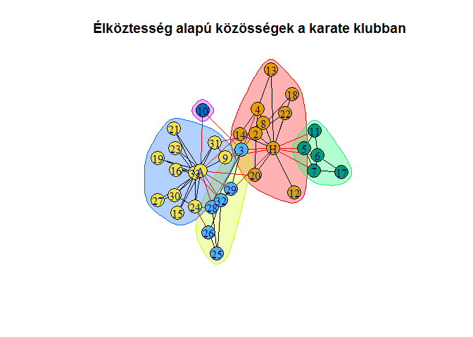<!-- -->

A véletlen sétás algoritmus alapötlete, hogy ha a csúcsokat termekként, az éleket termeket összekötő folyosóként képzeljük el, és egy adott teremből véletlenszerűen választunk folyosót amin elindulunk, nagy eséllyel egy sűrű alhálózaton belül fogunk bolyongani. Emiatt a véletlenség miatt az algoritmus eredménye nem ugyanaz minden futtatáskor. Ezzel szemben az élköztességen alapuló közösségkeresés abból indul ki, hogy az az él, aminek magas aköztessége, nagyobb csoportokat köt össze, emiatt valószínűleg csoportközi élről van szó, amit ha elvágunk, elkezd a hálózat csoportokra esni. Ez az algoritmus mindig ugyanazt az eredményt adja.

# Modellek

A gráfok kutatásában Erdős Pál és Rényi Alfréd véletlengráf-modellje volt korszakalkotó, mert sok, valós hálózatokban is észrevehető jellegzetességet produkált.


```r
er_graf <- sample_gnp(150, .3)
plot(er_graf,
     main="Erdős-Rényi féle véletlen gráf")
```

<div class="figure">

<p class="caption">(\#fig:erdos-renyi)Erdős-Rényi féle véletlen gráf</p>
</div>

```r
ggplot(data.frame(eloszlas=degree.distribution(er_graf)[which(degree.distribution(er_graf) > 0)],
                  fokszam = which(degree.distribution(er_graf) > 0)),
       aes(x=fokszam, y=eloszlas)) +
  geom_line() +
  geom_smooth(se=FALSE) +
  ggtitle("Erdős-rényi gráf fokszám-eloszlása") +
     ylab("Adott fokszám előfordulási aránya") +
     xlab("Fokszám")
```

<div class="figure">
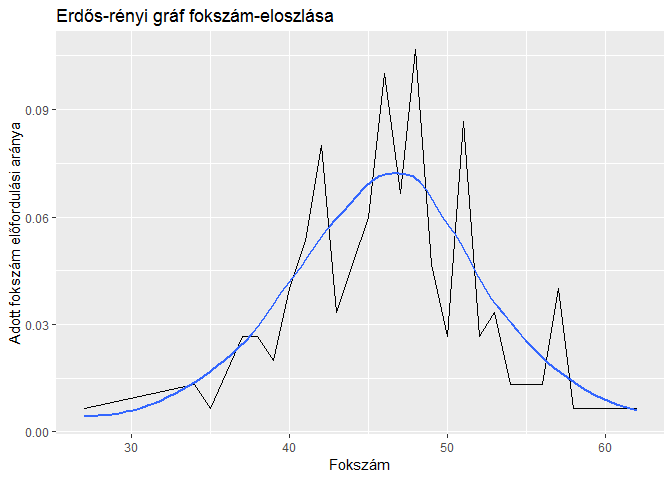
<p class="caption">(\#fig:erdos-renyi.eloszlas)Erdős-Rényi féle véletlen gráf fokszámeloszlása</p>
</div>

Minden él `p` valószínűséggel jön létre, így egy csúcshoz a többi `n-1` élből várhatóan `p * (n-1)` fog csatlakozni - ez esetünkben `0.3 * 149 = 44.7`, míg a létrejött gráfban átlagosan 45.3066667.
E gráftípusra igaz, hogy a benne lévő csúcsok számához képest az átló igen rövid (esetünkben 2), emiatt sokan és sokat tanulmányozták, illetve egészítették ki és módosítptták, hogy más  való életben is tapasztalt jellegzetességet is találjanak.

Barabási-Albert László és Albert Réka az ezredfordulón publikálták modelljüket, ami a preferenciális csatlakozás elvén működik: egy gráfhoz folyamatosan csatlakoznak új csúcsok, viszont hogy melyik meglévő csúcshoz csatlakoznak, az azok élszámától függ:


```r
ba_graf <- sample_pa(150)
plot(ba_graf,
     main="Barabási - Albert féle véletlen gráf")
```

<div class="figure">
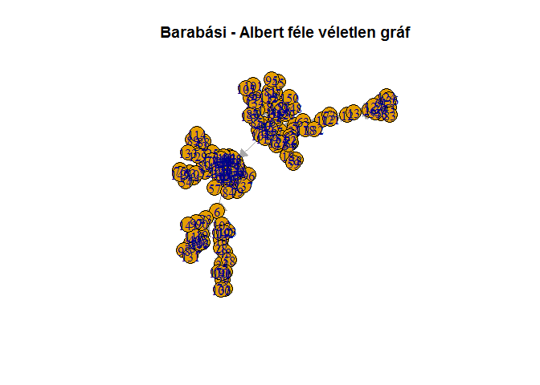
<p class="caption">(\#fig:ba_graf)Barabási-Albert féle véletlen gráf</p>
</div>

```r
ggplot(data.frame(eloszlas=degree.distribution(ba_graf)[-1],
                  fokszam = 1:max(degree(ba_graf))),
       aes(x=fokszam, y=eloszlas)) +
  geom_line() +
  ggtitle("Barabási - Albert gráf fokszám-eloszlása") +
     ylab("Adott fokszám előfordulási aránya") +
     xlab("Fokszám")
```

<div class="figure">

<p class="caption">(\#fig:ba-eloszlas)Barabási-Albert féle véletlen gráf fokszámeloszlása</p>
</div>

```r
ggplot(data.frame(eloszlas=degree.distribution(ba_graf)[-1],
                  fokszam =1:max(degree(ba_graf))),
       aes(x=fokszam, y=eloszlas)) +
  geom_line() +
  ggtitle("Barabási - Albert gráf fokszám-eloszlása logaritmikus skálán") +
     ylab("Adott fokszám előfordulási aránya") +
     xlab("Fokszám") +
  scale_x_log10() +
  scale_y_log10()
```

<div class="figure">
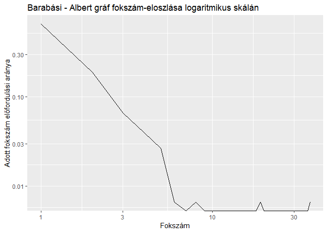
<p class="caption">(\#fig:ba-eloszlas-loglog)Barabási-Albert féle véletlen gráf fokszámeloszlása</p>
</div>

Ez a modell is teljesíti a kis világ kritériumot, az átlója 7, azonban a valós hálózatokban sok helyen megfigyelhető skálafüggetlen fokszám-eloszlást is reprodukálja. 

